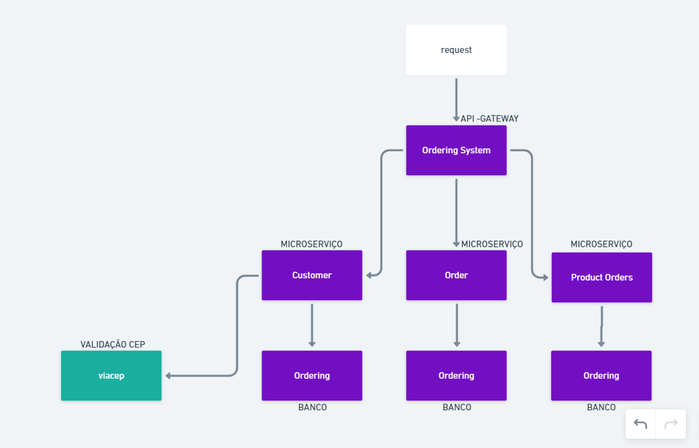

# GoOrdering
 Criado com NestJS. Esse projeto tem 4 aplicações. <br/>Sendo ordering-system o api-gateway do projeto e customer, order e product-orders os microserviços <br/> responsaveis pelo crud da aplicação.

### Requisitos

* Docker / Docker Compose

## Iniciar projeto

Via terminal, dentro da pasta do projeto:

```bash
$ docker-compose up -d --no-recreate
```


## Rotas
Disponível através do Swagger. Acessível através da rota */docs* ao inicialiar o projeto.


## Arquitetura




## Próximas etapas

* Login através de usuário/senha
* Encriptação de senhas
* Microserviço de configuração compartilhada
* Testes
